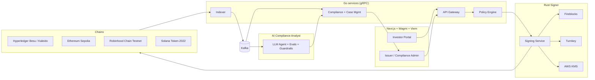

# Meridian Vault

**Institutional platform for issuing, holding, transferring and servicing tokenized real-world assets**

Compliance, custody and settlement enforced by smart contracts

> Source code is private. This repository is the public overview. Qualified hiring managers and clients can [request a walkthrough](#request-access).

## The problem

Banks and asset managers are moving funds, bonds and credit on-chain (BlackRock BUIDL, Franklin Templeton BENJI, JPMorgan Kinexys). Each needs the same hard parts done right: investor eligibility enforced at the token level, institutional custody with policy-based signing, regulatory-grade monitoring, and operations that run on both private and public networks.

## The scenario

A fund manager tokenizes a **$50M private credit fund**. KYC-verified investors subscribe with a stablecoin, hold shares in MPC custody, transfer only to other eligible investors, and receive monthly interest distributions automatically.

## Architecture

## ERC standards implemented

| Standard | Purpose in the platform |
|---|---|
| **ERC-3643** (T-REX) | Permissioned fund share token: on-chain identity registry, modular compliance, freeze, forced transfer, wallet recovery |
| **ERC-1400** (ERC-1410 / 1594 / 1643 / 1644) | Partitioned share classes and lockup tranches, transfer validation, legal document anchoring, controller operations |
| **ERC-20** + **EIP-2612** | Settlement stablecoin for subscriptions, redemptions and distributions (atomic delivery versus payment) |
| **ERC-721** | Asset certificate representing the underlying loan pool |
| **ERC-1155** | Fractional units and distribution vouchers |
| **ERC-4626** | Fund share vault with NAV-per-share accounting |
| **ERC-7540** | Asynchronous redemption queue (request, settle, claim) |
| **ERC-1967 / ERC-1822** (UUPS) | Upgradeable contracts behind timelock and multisig governance |
| **ERC-734 / ERC-735** (ONCHAINID) | Identity keys and KYC claims checked on every transfer |
| **ERC-165** | Interface detection |

## Capabilities

| Capability | What it demonstrates |
|---|---|
| AI compliance analyst | Background agent triages AML alerts from Kafka; interactive copilot answers analyst questions; both use a read-only MCP server; human approves every action; evaluated and guarded against prompt injection |
| Rust signing service | Institutional key management across MPC providers and AWS KMS, with cold/warm/hot wallet tiers |
| Event-driven compliance | Kafka backbone feeds sanctions screening, fraud rules and case management |
| On-chain compliance | Transfers to non-verified wallets are rejected by the contract itself |
| MPC custody | Transactions above policy thresholds require M-of-N approval before signing |
| Atomic DvP settlement | Shares and stablecoin swap in a single transaction (T+0) |
| Corporate actions | Automated interest distribution to all eligible holders |
| AML monitoring | Velocity and structuring rules raise alerts; compliance officer can freeze |
| Enterprise and public chains | Same contracts on Hyperledger Besu (QBFT), Robinhood Chain (public L2 for real-world assets) and Ethereum |
| Upgrade governance | UUPS proxies authorized by timelock and multisig |

## Demo walkthrough

| # | Step |
|---|---|
| 1 | Issuer deploys the fund token from the admin portal |
| 2 | Investor completes KYC; identity claim is issued on-chain |
| 3 | Investor subscribes with USDC; shares settle atomically |
| 4 | A transfer over $1M triggers 2-of-3 MPC approval |
| 5 | A transfer to an unverified wallet is rejected on-chain |
| 6 | Monitoring flags structuring; the compliance officer freezes the wallet |
| 7 | Monthly interest is paid to every holder |
| 8 | The same flow runs on Besu and Sepolia |

Demo video: *coming soon*

## Engineering approach

| Principle | Application |
|---|---|
| Two deep areas | Custody and signing security; compliance and AI pipeline |
| Measured | Published latency, throughput and cost results from load tests |
| Reasoned | RFCs and architecture decision records with rejected alternatives |
| Failure-ready | Threat models, incident runbooks, chaos tests |

## Security and governance

| Practice | Detail |
|---|---|
| Testing | Foundry unit, fuzz and invariant tests; coverage target over 95% |
| Static analysis | Slither and Aderyn gates in CI |
| Threat modeling | STRIDE per component |
| Control mapping | NYDFS Part 500, NIST CSF 2.0, SOC 2, CCSS, OWASP SCSVS |
| Architecture decisions | Recorded as ADRs (for example ERC-3643 vs ERC-1400, MPC vs HSM, Besu vs public L2) |

Control mapping shows design alignment only. It is not a certification or regulatory approval.

## Tech stack

| Layer | Technologies |
|---|---|
| Smart contracts | Solidity, Foundry, OpenZeppelin, T-REX |
| Frontend | Next.js, React, TypeScript, Wagmi, Viem |
| Backend | Go, Rust, gRPC, Kafka |
| AI | LLM agent, evaluation harness (Python), guardrails |
| Custody | Fireblocks, Turnkey, DFNS |
| Chains | Hyperledger Besu, Kaleido, Ethereum Sepolia, Robinhood Chain Testnet, Solana |
| Infrastructure | Docker, Kubernetes, Terraform, AWS, GitHub Actions |
| Observability | OpenTelemetry, Prometheus, Grafana, SLOs, load and chaos testing |

## Related work

| Project | Description |
|---|---|
| [nexus-protocol](https://github.com/colemanwhaylon/nexus-protocol) | DeFi, NFT and enterprise tokenization platform with contracts deployed on Sepolia |

## Request access

Full source code, live demo and the architecture walkthrough are available to hiring managers and prospective clients.

Contact: [Whaylon Coleman on GitHub](https://github.com/colemanwhaylon)

---

Copyright (c) 2026 Whaylon Coleman. All rights reserved. Meridian Vault is a portfolio reference implementation.
