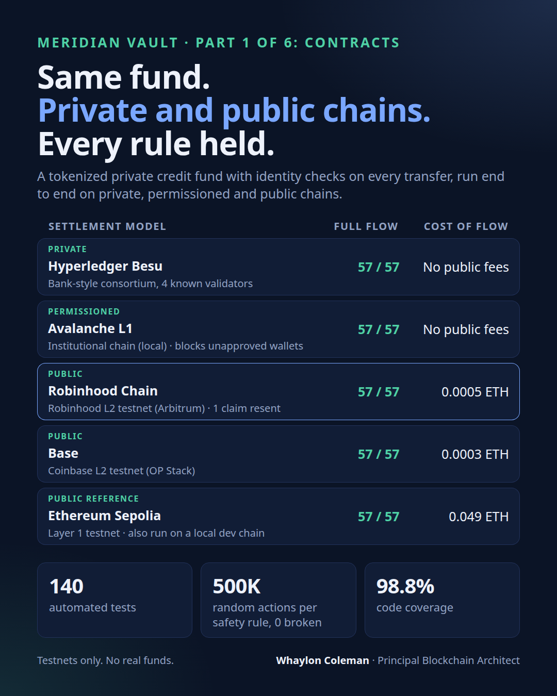
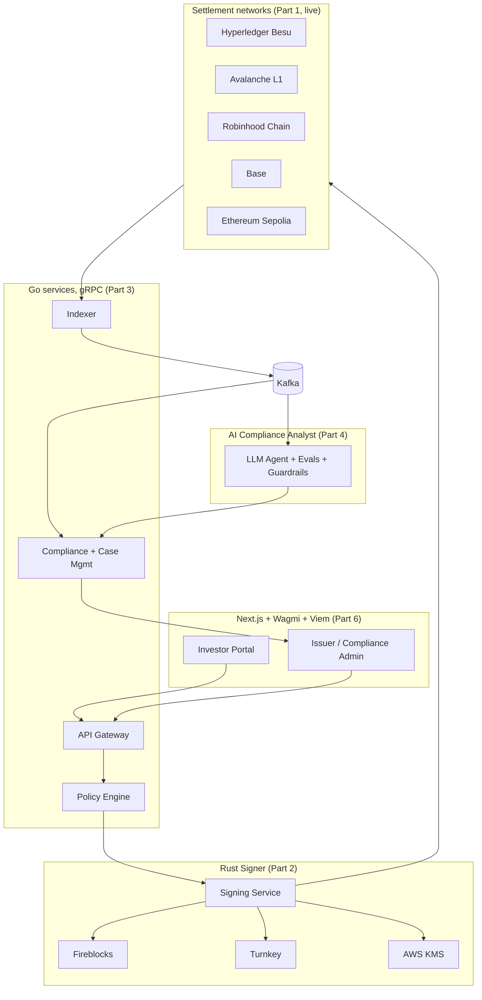

# Meridian Vault

**Institutional platform for issuing, holding, transferring and servicing tokenized real-world assets**

Compliance, custody and settlement enforced by smart contracts

> Built in public, one part at a time. Source code is private; this repository is the public overview. Qualified hiring managers and clients can [request a walkthrough](#request-access).

## The problem

Banks and asset managers are moving funds, bonds and credit on-chain (BlackRock BUIDL, Franklin Templeton BENJI, JPMorgan Kinexys). Each needs the same hard parts done right: investor eligibility enforced at the token level, institutional custody with policy-based signing, regulatory-grade monitoring, and operations that run on both private and public networks.

## The scenario

A fund manager tokenizes a **$50M private credit fund**. KYC-verified investors subscribe with a stablecoin, hold shares, transfer only to other eligible investors, and cash out through a redemption queue priced at the fund's net asset value.

## Build status

| Part | Scope | Status |
|---|---|---|
| **1** | **Contracts: ERC-3643 fund shares, NAV oracle, ERC-4626/7540 vault, compliance modules, multi-chain deploys** | **Complete** |
| 2 | Custody: Rust signing service, MPC / HSM / cloud KMS, wallet tiers | Planned |
| 3 | Compliance pipeline: Go services, Kafka, gRPC, case management | Planned |
| 4 | AI compliance analyst with human approval, evals and guardrails | Planned |
| 5 | Kubernetes, observability, load and chaos testing | Planned |
| 6 | Investor and admin portals, Solana Token-2022, demo video | Planned |

## Part 1 results

The same contracts and the same deployment script ran the full investor journey (KYC, subscribe, transfer, blocked transfer to an unverified wallet, redemption request, fulfilment, claim) on four settlement models.

| Settlement model | Network | Full flow | Cost of the flow |
|---|---|---|---|
| Private consortium | Hyperledger Besu, 4 QBFT validators | 57 / 57 transactions | No public fees |
| Institutional permissioned | Avalanche L1 (local), chain-level allowlists | 57 / 57 transactions | No public fees |
| Company public L2 (Arbitrum) | Robinhood Chain Testnet | 57 / 57 transactions (1 resent with more gas) | 0.000492 test ETH |
| Company public L2 (OP Stack) | Base Sepolia | 57 / 57 transactions | 0.000283 test ETH |
| Public reference (L1) | Ethereum Sepolia | 57 / 57 transactions | 0.049161 test ETH |

Costs come from transaction receipts on a single run; testnet gas prices vary.

On the permissioned Avalanche L1, the chain itself rejected a non-allowlisted wallet and blocked contract deployment by a non-approved account, before any contract-level KYC check ran.

| Quality evidence | Result |
|---|---|
| Automated tests | 140 passing |
| Invariants | 6 safety rules held across 10,000 randomized runs, 500,000 actions each |
| Line coverage | 98.76% (CI gate: 95%) |
| Static analysis | Slither and Aderyn, zero high-severity findings after review |
| Threat model | 18 STRIDE threats mapped to controls and test evidence |

### Live contracts (testnets)

| Contract | Ethereum Sepolia | Base Sepolia | Robinhood Chain Testnet |
|---|---|---|---|
| Fund share token (ERC-3643) | [0x1E8A…3d41](https://sepolia.etherscan.io/address/0x1E8A3D7A08F1C450BE22c84082c79CffE9bF3d41) | [0x277E…E9d9](https://sepolia.basescan.org/address/0x277E4e94036926E990216d6FE969A51A4E2dE9d9) | [0x277E…E9d9](https://explorer.testnet.chain.robinhood.com/address/0x277E4e94036926E990216d6FE969A51A4E2dE9d9) |
| Fund vault (ERC-4626 / 7540) | [0x4e4C…D6Fb](https://sepolia.etherscan.io/address/0x4e4C292f9387e3A5d6b961FF8D02EC78Ee45D6Fb) | [0xf339…9dC7](https://sepolia.basescan.org/address/0xf3396bc840b147Cb0e0e6fE98C94909a03B89dC7) | [0xf339…9dC7](https://explorer.testnet.chain.robinhood.com/address/0xf3396bc840b147Cb0e0e6fE98C94909a03B89dC7) |

Verified source on Etherscan and Basescan for the stablecoin, NAV oracle and vault. Base and Robinhood Chain addresses match because the same deployer created the contracts in the same order on both chains.

## Target architecture

Part 1 (contracts and chains) is live; the services, custody and AI layers arrive in Parts 2 to 6. Use the diagram's full-screen and zoom controls to explore it.

Note: this is an abbreviated view of the target architecture. It omits supporting components (load balancing, read model, nonce manager, outbox, dead-letter topics, observability stack) that are specified in the system design RFC. A full architecture with detailed component and sequence diagrams will be published as each part is built.

### Design notes

The target architecture is specified in a system design RFC with capacity targets, ten design decisions and a failure-mode table. Highlights:

| Concern | Design |
|---|---|
| Transaction ordering under load | Per-wallet single-writer nonce manager and a pool of hot wallets, with replacement-by-fee for stuck transactions |
| Retries and duplicates | Idempotency keys on every write API; transactional outbox for every emitted event |
| Chain reorganisations | Finality-aware indexing with per-chain confirmation depth; idempotent, replay-safe consumers |
| Read scale | Read model fed by the indexer; portals never read the chain directly |
| Ordering and scale of events | Kafka partitioned by fund; dead-letter topics; lag alerts |
| Overload | Bounded queues and backpressure in front of policy and signer |
| Safety | Policy decision required before any signature; fail closed; humans approve AI-recommended actions |

Scale targets are stated per component (for example peak write and read rates, policy and signing latency, event lag, availability, recovery objectives) and will be published as measured results in Part 5. No capacity figure is claimed before it is measured.

## ERC standards

| Standard | Purpose in the platform | Status |
|---|---|---|
| **ERC-3643** (T-REX) | Permissioned fund share token: on-chain identity registry, modular compliance, freeze, forced transfer, wallet recovery | Live |
| **ERC-734 / ERC-735** (ONCHAINID) | Identity keys and KYC claims checked on every transfer | Live |
| **ERC-4626** | Fund share vault with NAV-per-share accounting | Live |
| **ERC-7540** | Asynchronous redemption queue (request, fulfil, claim) | Live |
| **ERC-20** + **EIP-2612** | Settlement stablecoin (test) for subscriptions and redemptions | Live |
| **ERC-1400** | Partitioned share classes, lockup tranche, document anchoring | Live (thin) |
| **ERC-721** | Asset certificate for the underlying loan pool | Live (thin) |
| **ERC-1155** | Fractional units and distribution vouchers | Live (thin) |
| **ERC-1967 / ERC-1822** (UUPS) | Upgradeable vault and oracle; admin-controlled today, timelock and multisig planned | Live (admin) |
| **ERC-165** | Interface detection | Live |

## Capabilities

| Capability | What it demonstrates | Status |
|---|---|---|
| On-chain compliance | Transfers to unverified or restricted-country wallets are rejected by the contract itself | Live |
| Compliance modules | Country restriction, investor cap, lockup | Live |
| NAV-priced subscriptions | Price feed with staleness and deviation guards | Live |
| Asynchronous redemptions | Request, fulfil at the next NAV, claim; shares escrowed by freezing | Live |
| Private, permissioned and public chains | Same contracts on Besu, an allowlisted Avalanche L1, Robinhood Chain, Base and Ethereum | Live |
| Chain-level permissioning | Avalanche L1 transaction and deployer allowlists | Live (local) |
| Rust signing service and MPC custody | Policy-based signing, M-of-N approval, wallet tiers | Planned (Part 2) |
| Event-driven compliance and AML monitoring | Kafka-fed screening, rules, case management, freeze | Planned (Part 3) |
| AI compliance analyst | Alert triage and analyst copilot with human approval of every action | Planned (Part 4) |
| Atomic DvP settlement and corporate actions | Single-transaction share and stablecoin swap; automated distributions | Planned |
| Upgrade governance | Timelock and multisig authorization | Planned |

## Engineering approach

| Principle | Application |
|---|---|
| Two deep areas | Custody and signing security; compliance and AI pipeline |
| Measured | Results published only from real runs (receipts, test runs, CI) |
| Reasoned | 15 architecture decision records with rejected alternatives |
| Failure-ready | Threat models now; incident runbooks and chaos tests in Part 5 |

## Security and governance

| Practice | Detail |
|---|---|
| Testing | Foundry unit, fuzz and invariant tests; 98.76% line coverage |
| Static analysis | Slither and Aderyn gates in CI |
| Threat modeling | STRIDE; contracts layer complete |
| Control mapping | NYDFS Part 500, NIST CSF 2.0, SOC 2, CCSS, OWASP SCSVS (partial, updated per part) |
| Architecture decisions | ADRs, for example ERC-3643 as primary standard, async redemptions, settlement network lineup |

Control mapping shows design alignment only. It is not a certification or regulatory approval. Testnets only; no real funds.

## Tech stack

| Layer | Technologies | Status |
|---|---|---|
| Smart contracts | Solidity, Foundry, OpenZeppelin, T-REX, ONCHAINID | Live |
| Chains | Hyperledger Besu, Avalanche L1 (Subnet-EVM), Robinhood Chain, Base, Ethereum Sepolia | Live |
| CI and security | GitHub Actions, Slither, Aderyn, coverage and gas gates | Live |
| Backend | Go, Rust, gRPC, Kafka | Planned |
| AI | LLM agent, evaluation harness (Python), guardrails | Planned |
| Custody | Fireblocks, Turnkey, DFNS, AWS KMS | Planned |
| Frontend | Next.js, React, TypeScript, Wagmi, Viem | Planned |
| Infrastructure and observability | Docker (live), Kubernetes, Terraform, AWS, OpenTelemetry, Prometheus, Grafana | Partial |

## Related work

| Project | Description |
|---|---|
| [nexus-protocol](https://github.com/colemanwhaylon/nexus-protocol) | DeFi, NFT and enterprise tokenization platform with contracts deployed on Sepolia |

## Request access

A guided architecture walkthrough, test results and the source code are available to hiring managers and prospective clients.

Contact: [Whaylon Coleman on GitHub](https://github.com/colemanwhaylon)

---

Copyright (c) 2026 Whaylon Coleman. All rights reserved. Meridian Vault is a portfolio reference implementation.
